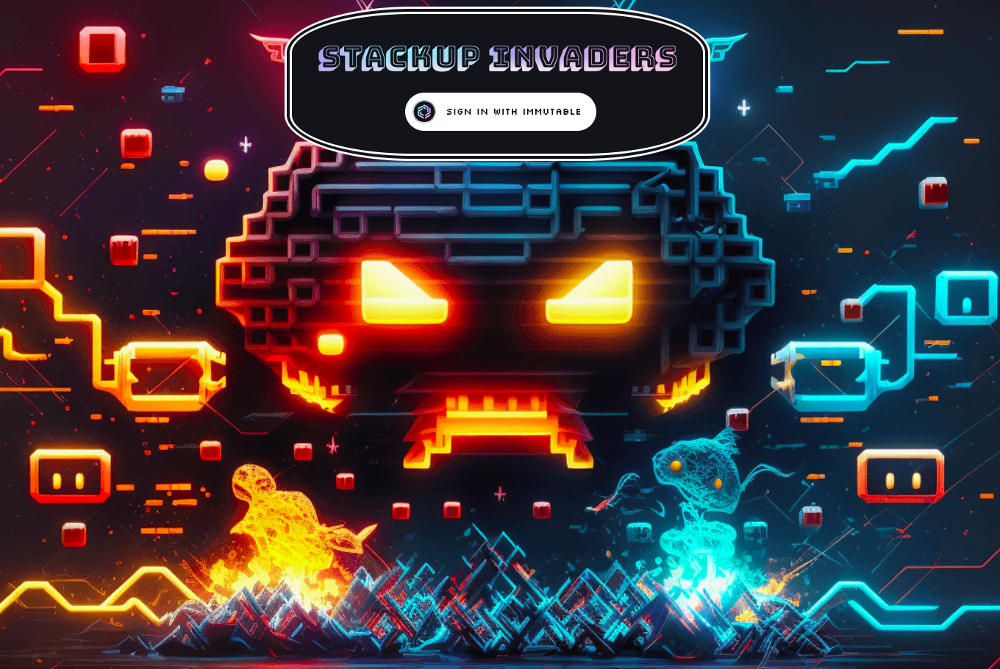

# Write Up

**Video sample** of the game available [here](./video-sample.mp4)

**Production environment:** https://stackup-imx.sampleweb3.dev/  
**Dev environment:** https://stackup-imx.dev.sampleweb3.dev/

- **REWORKED THE GAME ENTIRELY**
  - Migrated to Typescript
  - Used [Class within GameLogic](./src/components/GameLogic). A projectile, an enemy and the player extend the same class ([Game Entity](./src/components/GameLogic/GameEntity.ts)).
    - [Player Class](./src/components/GameLogic/Player.ts)
    - [Enemy Class](./src/components/GameLogic/Enemy.ts)
    - [Projectile Class](./src/components/GameLogic/Projectile.ts)
  - The game has [states](./src/components/GameLogic/GameState.ts) such pause, finished, ...
  - The game has [interactions](./src/components/GameLogic/GameState.ts) such as start game, toggle pause, ...

- **[3 LEVELS](./src/components/GameLogic/GameLevel.ts)**
  - LVL 1 contains 10 enemies, fire rate is 1 projectile/sec
  - LVL 2 contains 16 enemies, fire rate is  2 projectiles/sec
  - LVL 3 contains 27 enemies, fire rate is 5 projectiles/sec

- **CUSTOMISATION**
  - Custom [smart contract](./contracts/game/contracts/StackupIMXCollection.sol) based on ImmutableERC721 to allow the players to buy NFTs from the game.

  - 4 spaceships (3 NFTs)
  - 4 projectiles (3 NFTs)
  - The non-nfts are attributed by default to the player.

- **CLAIMING/BUYING NFT**

  - Claiming or buying a NF [generate a new json file within a S3 Bucket](./api/index.js).

  - **Claiming**: The original game was granting the player the mint role, I preferred to only grant it to game owner and the game owner will mint it to the user address. The user doesn't see any transaction even though one was made, I also don't want a user to abuse minting.

  - **Buying**: The user is interacting with the custom smart contract to buy the NFTs. A serverless function then verify the transaction hash and create the appropriate JSON file to represent the off chain nft dynamically.

- **SELLING NFT**

  - Not done yet. Too many issues with IMX, they often update the SDK, make changes on API side that impact actual code. (Next update is Jan 18 that requires all app to be up to date or the passport wallet doesn't work anymore...)

- **INFRASTRUCTURE**
  - The infrastructure code is not available on this repo.
    If you'd like to check it, contact me directly.

  - All the infrastructure is automated using Terraform.  
  - I use AWS organization with 3 AWS accounts:
    - Infra (deploy to dev & prod from Github or Local)
    - Dev
    - Prod

  - The game is hosted on AWS behind cloudfront and S3.
  - The deployment is automated thanks to Github workflow (it will build and push accordingly)
  - I bought the domain sampleweb3.dev months ago to push web3 sample projects. I'm using the subdomain https://stackup-imx.sampleweb3.dev/ for this game. The root domain is a blank astro project at the time of writing.

